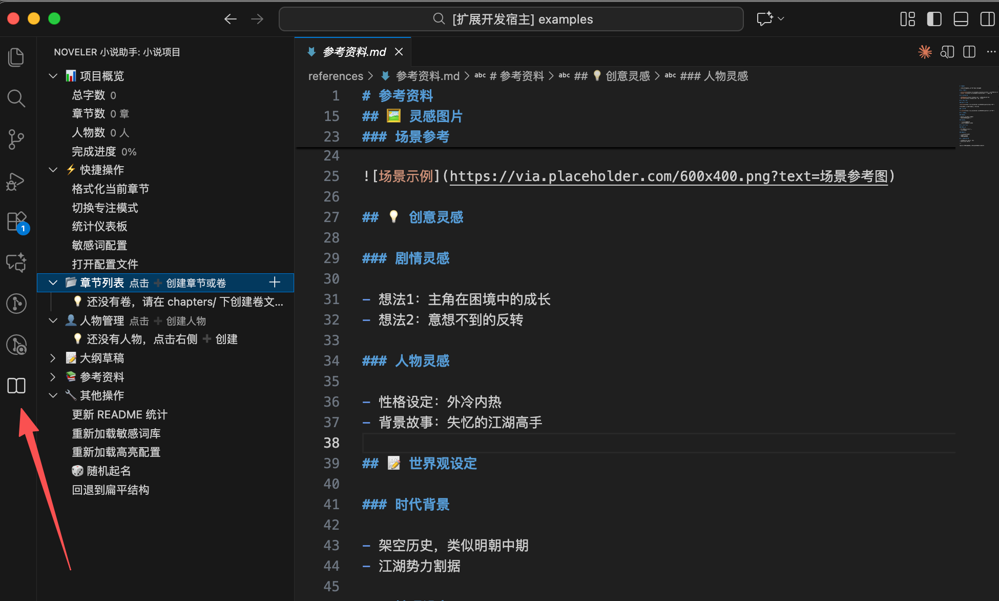

# Noveler - 中文小说写作助手

专为中文小说写作设计的 VS Code 插件，让创作更专注、更高效。

## 📑 目录

- [✨ 核心特性](#-核心特性)
- [🎛️ 侧边栏视图](#️-侧边栏视图)
- [🚀 核心功能](#-核心功能)
  - [📝 语法高亮](#-语法高亮)
  - [📊 字数统计](#-字数统计)
  - [🎨 智能格式化](#-智能格式化)
  - [🛡️ 敏感词检测](#️-敏感词检测)
  - [📚 分卷管理](#-分卷管理)
  - [✍️ 随机起名](#️-随机起名)
  - [📂 项目管理](#-项目管理)
  - [🖋️ 写作辅助](#️-写作辅助)
- [⚡ 快速开始](#-快速开始)
- [📄 文件格式](#-文件格式)
- [⚙️ 配置](#️-配置)
- [🎮 常用命令](#-常用命令)
- [❓ 常见问题](#-常见问题)
- [🎉 版本亮点](#-版本亮点)
- [🤝 贡献](#-贡献)
- [📜 开源协议](#-开源协议)
- [📞 联系方式](#-联系方式)

---

## ✨ 核心特性

- 📝 **语法高亮** - 对话、人物名称自动高亮，内容一目了然
- 📊 **精准字数** - 符合网文标准的实时字数统计
- 🛡️ **敏感词检测** - 三级词库自动检测，规避审核风险
- 📚 **分卷管理** - 支持多卷结构，适合长篇创作
- ✍️ **随机起名** - 7 种风格，数千种组合，一键生成角色名
- 🎨 **智能格式化** - 标点、引号、空格自动规范


---

## 🎛️ 侧边栏视图

点击左侧活动栏的 📖 图标打开 Noveler 侧边栏，这是插件的主要操作界面。



### 项目概览
- 显示小说名称、总字数、章节数
- 一键访问配置文件
- 快速更新 README

### 章节管理
- 查看所有章节及状态（📝草稿 | ✏️初稿 | 🔧修改中 | ✅已完成）
- 右键章节：重命名、标记状态、删除
- 鼠标悬停显示详细字数统计
- **分卷支持**：创建卷、在卷内创建章节、移动章节

### 人物设定
- 查看所有人物档案
- 创建人物文件
- **随机起名**：一键生成各种风格的角色名

### 快捷操作
- 格式化当前章节
- 切换专注模式
- 刷新视图（刷新侧边栏并更新 README 统计）

### 其他操作
- 统计仪表板
- 配置敏感词库
- 打开配置文件
- 🎲 随机起名
- 刷新敏感词库
- 刷新高亮设置
- 切换到分卷模式/退出分卷模式（根据当前模式动态显示）

---

## 🚀 核心功能

### 📝 语法高亮

自动高亮对话和人物名称，让小说内容层次分明。

- 支持 6 种引号格式：`「」` `""` `""` `''` `""` `''`
- 自动读取 `characters/` 目录和配置文件中的人物名称
- 可自定义高亮颜色和样式


---

### 📊 字数统计

符合网文标准的实时统计，状态栏显示 `总计 | 正文 | 标点`。

**特点**：
- ✅ 实时更新，选中文本单独统计
- ✅ 自动排除 Front Matter、标题、注释
- ✅ 侧边栏悬停查看详细统计
- ✅ 保存时自动更新章节字数
- ✅ 分卷模式下显示所属卷信息

**统计规则**：
- 总计 = 正文 + 标点（不含空格）
- 正文 = 中文汉字 + 英文字母和数字
- 标点 = 中文标点 + 英文标点

---

### 🎨 智能格式化

一键规范标点、引号、空格，让文稿更专业。

- **引号统一**：自动转换中英文引号为配置的样式
- **标点规范**：统一中文标点符号（双向转换）
- **空格处理**：删除中文之间多余的空格
- **特殊符号**：统一省略号（…）和破折号（——）

> 💡 Front Matter 和 HTML 注释内容不会被格式化

---

### 🛡️ 敏感词检测

三级词库系统，自动检测敏感词汇，帮助规避审核风险。

**三级词库**：
- **高危**：政治、严重暴力、严重违法（推荐启用）
- **中危**：色情、一般违法、宗教敏感（推荐启用）
- **低危**：广告、争议词汇、不文明用语（可选启用）

**检测方式**：
- ⚡ 输入时自动检测（防抖 500ms）
- 💾 保存时再次检查
- 📊 状态栏显示敏感词数量

**可视化标注**：
- 黄色波浪线标记敏感词
- 问题面板显示详细信息
- 悬停查看词汇等级和建议

**快速修复**：
- 添加到白名单（如人物名、专有名词）
- 删除敏感词
- 替换为星号（***）
- 忽略此处

**自定义词库**：支持项目级黑名单和白名单配置

---

### 📚 分卷管理

支持多卷结构，适合长篇小说创作。

**功能**：
- 📖 创建卷：在侧边栏点击创建，支持正文/前传/后传/番外
- 📝 章节管理：在卷内创建章节，移动/复制章节到其他卷
- 🔄 结构迁移：一键从扁平结构迁移到分卷，支持回滚
- 📊 统计显示：状态栏显示当前章节所属卷及统计信息

**卷类型**：
- **正文**：主线剧情
- **前传**：故事发生前的剧情
- **后传**：主线之后的延续
- **番外**：独立的特别篇章

**章节编号模式**：
- 全局连续：所有章节连续编号（第 1 章、第 2 章...）
- 按卷重置：每卷重新编号（第一卷-第 1 章、第二卷-第 1 章...）

---

### ✍️ 随机起名

一键生成角色名，7 种风格任选。

**风格选择**：
- 🇨🇳 中文现代：常见姓氏 + 现代名字
- 🏮 中文古典：单字名、双字名、雅致字
- ⚔️ 中文玄幻：仙侠、玄幻命名规则
- 🇬🇧 英文名：First Name + Last Name
- 🇯🇵 日文名：日式姓氏 + 名字
- 🏰 西幻名：奇幻风格命名
- 🌀 虚构名：完全虚构的独特名字

**智能交互**：
- "再来一组"快速生成更多选项
- 创建人物文件
- 复制到剪贴板
- 插入到光标位置

**名字库**：数百个精选名字，组合可能性达数千至数万

---

### 📂 项目管理

快速创建和组织你的小说项目。

**初始化项目**：一键创建标准的小说项目结构
```
my-novel/
├── chapters/       # 章节目录
├── characters/     # 人物目录
├── drafts/         # 草稿和大纲
├── references/     # 参考资料
├── novel.jsonc     # 小说配置
└── README.md       # 项目说明
```

**创建章节**：
- 自动计算章节序号（支持中文数字：第一章、第十章、第一百章等）
- 带有完整 Front Matter 的标准章节模板
- 自动组织到 `chapters/` 目录

**创建人物**：
- 一键创建人物档案文件
- 完整的人物信息模板（外貌、性格、背景、关系等）
- 自动保存到 `characters/` 目录

**README 自动更新**：
- 扫描章节目录，统计总字数和完成章节数
- 自动生成章节列表（带状态图标）
- 自动扫描并分类展示人物

---

### 🖋️ 写作辅助

更多实用功能，提升写作体验。

- **自动空行**：按回车时自动插入空行，保持段落间距
- **段落缩进**：自动添加两个全角空格缩进
- **专注模式**：一键进入全屏 Zen Mode，隐藏所有干扰
- **项目级配置**：初始化时自动创建 `.vscode/settings.json`（自动保存、格式化等）
- **输入验证**：创建章节和人物时自动过滤非法字符

---

## ⚡ 快速开始

### 1. 安装插件

在 VS Code 扩展市场搜索 "Noveler" 并安装。

或按 `Cmd+Shift+X` (Mac) / `Ctrl+Shift+X` (Windows/Linux) 打开扩展面板。

### 2. 打开侧边栏

点击左侧活动栏的 📖 图标，打开 Noveler 侧边栏。

### 3. 初始化项目

在侧边栏点击"初始化项目"按钮，输入小说名称。

插件会自动创建标准的小说项目结构，包括：
- 📁 项目目录（chapters, characters, drafts, references）
- 📝 配置文件（novel.jsonc）
- ⚙️ **VSCode 项目配置**（`.vscode/settings.json`）
  - ✅ 自动保存（2秒延迟，防止意外丢失内容）
  - ✅ 文件格式化（自动清理行尾空格）
  - ✅ Markdown 预览优化
  - ✅ 仅对当前项目生效，不影响其他项目

### 4. 创建章节

在侧边栏"章节管理"组点击 ➕ 按钮，输入章节名称（如"陨落的天才"）。

章节号会自动计算和添加。

### 5. 开始写作

打开章节文件，享受语法高亮和实时字数统计！

> 💡 提示：也可以使用命令面板（`Cmd/Ctrl+Shift+P`）输入"Noveler"查看所有命令。

---

## 📄 文件格式

### 章节文件示例

```markdown
---
title: "第一章 初入江湖"
chapter: 1
wordCount: 0
status: "草稿"  # 草稿 | 初稿 | 修改中 | 已完成
---

# 第一章 初入江湖

清晨的阳光透过窗棂洒在青石板上。

「师父，我想下山。」张无忌低声说道。
```

**关键字段**：
- `title`: 章节标题
- `chapter`: 章节号
- `wordCount`: 字数（自动更新）
- `status`: 状态（影响侧边栏图标）

> 📖 完整字段说明请查看 [文件格式文档](docs/文件格式说明.md)

---

### 人物文件示例

```markdown
---
name: "张无忌"
gender: "男"
importance: "主角"
---

# 张无忌

## 基本信息
...

## 外貌描写
...
```

**关键字段**：
- `name`: 人物名称
- `importance`: 主角 | 重要配角 | 次要配角 | 路人
- `firstAppearance`: 首次登场章节

---

## ⚙️ 配置

### 核心配置

在项目根目录的 `novel.jsonc` 文件中配置（侧边栏可一键打开）：

```jsonc
{
  "name": "我的小说",
  "noveler": {
    // 敏感词检测
    "sensitiveWords": {
      "enabled": true,
      "levels": {
        "high": true,    // 高危词库
        "medium": true,  // 中危词库
        "low": false     // 低危词库
      }
    },

    // 自动功能
    "autoEmptyLine": true,        // 自动空行
    "paragraphIndent": true,      // 段落缩进
    "autoSave": true,             // 自动保存

    // 分卷功能
    "volumes": {
      "enabled": false,           // 是否启用分卷
      "chapterNumbering": "sequential"  // 章节编号: sequential | reset | hybrid
    },

    // 语法高亮
    "highlight": {
      "dialogue": {
        "color": "#ce9178"
      },
      "character": {
        "color": "#4ec9b0",
        "fontWeight": "bold"
      }
    },

    // 格式化
    "format": {
      "chineseQuoteStyle": "「」",  // 中文引号样式
      "autoFormat": true
    }
  }
}
```

> 📖 完整配置说明请查看 [novel.jsonc 配置文档](docs/novel-json配置说明.md)

---

## 🎮 常用命令

| 命令 | 说明 | 快捷方式 |
|------|------|----------|
| `Noveler: 初始化小说项目` | 在空文件夹中初始化项目结构 | 侧边栏按钮 |
| `Noveler: 创建新章节` | 创建新章节文件 | 侧边栏 ➕ |
| `Noveler: 创建人物` | 创建人物文件 | 侧边栏 ➕ |
| `Noveler: 随机起名` | 随机生成角色名 | 侧边栏按钮 |
| `Noveler: 格式化文档` | 格式化当前文档 | 右键菜单 |
| `Noveler: 刷新` | 刷新侧边栏和统计信息 | 侧边栏按钮 |
| `Noveler: 切换专注模式` | 进入/退出专注写作模式 | 右键菜单 |

> 💡 提示：按 `Cmd/Ctrl+Shift+P` 打开命令面板，输入 "Noveler" 查看所有命令

---

## ❓ 常见问题

**Q: 如何打开侧边栏？**
A: 点击左侧活动栏的 📖 图标，或使用命令 `查看: 打开侧边栏`。

**Q: 字数统计包含标点吗？**
A: 包含。总计 = 正文（汉字+字母+数字）+ 标点。符合网文计费标准。

**Q: 敏感词检测会影响性能吗？**
A: 不会。使用防抖技术（500ms）和高效算法（Trie 树），只在必要时检测。

**Q: 如何切换到分卷结构？**
A: 使用命令 `Noveler: 迁移到分卷结构`，插件会引导你完成迁移。支持随时回滚。

**Q: 格式化会修改我的内容吗？**
A: 不会修改文字，只调整标点符号和空格。Front Matter 和注释不受影响。

**Q: 为什么我的人物名称没有高亮？**
A: 确保人物文件在 `characters/` 目录下，或在 `novel.jsonc` 的 `characters` 数组中添加名称。

**Q: 自动空行和段落缩进冲突吗？**
A: 不冲突。可以同时启用：自动空行负责段落间隔，段落缩进负责每段开头。

> 更多问题请访问 [FAQ 文档](docs/FAQ.md) 或 [提交 Issue](https://github.com/ChangFang911/vscode-plugin-noveler/issues)

---

## 🎉 版本亮点

### 当前版本 v0.6.4
- 🧹 功能简化（删除 autoSave 配置、合并刷新命令、删除未实现配置）
- ⚙️ VSCode 项目配置自动创建（初始化时自动创建 `.vscode/settings.json`）
- 🏷️ 卷类型自动文件夹重命名（修改卷类型时自动更新文件夹名）
- ⚡ 异步 I/O 优化（大项目 100+ 章节无卡顿）

### 上一版本 v0.6.1
- 🧹 架构优化（代码量 -8.5%，打包体积 -12.5%）
- 📦 打包优化（esbuild 单文件打包，编译输出 -53%）
- 📖 文档完善（README 重构，新增 FAQ 和文件格式说明）

### v0.6.0
- ✨ 随机起名功能（7 种姓名风格，数千种组合）
- 🔧 简化迁移流程（一键迁移到分卷结构）
- 📚 完整的分卷管理功能

### 下一版本计划 v0.7.0+
- 🤖 AI 写作助手集成
- 📈 写作目标跟踪
- 🔄 更丰富的导出格式（EPUB、PDF）
- 👥 人物关系图可视化

> 完整更新历史请查看 [CHANGELOG.md](CHANGELOG.md)

---

## 🤝 贡献

欢迎提交 Issue 和 Pull Request！

1. Fork 本仓库
2. 创建你的特性分支 (`git checkout -b feature/AmazingFeature`)
3. 提交你的更改 (`git commit -m 'Add some AmazingFeature'`)
4. 推送到分支 (`git push origin feature/AmazingFeature`)
5. 打开一个 Pull Request

---

## 📜 开源协议

[MIT License](LICENSE)

---

## 📞 联系方式

- **GitHub**: [https://github.com/ChangFang911/vscode-plugin-noveler](https://github.com/ChangFang911/vscode-plugin-noveler)
- **Issues**: [提交问题](https://github.com/ChangFang911/vscode-plugin-noveler/issues)
- **讨论**: [GitHub Discussions](https://github.com/ChangFang911/vscode-plugin-noveler/discussions)

---

**Happy Writing! 祝写作愉快！** ✍️
