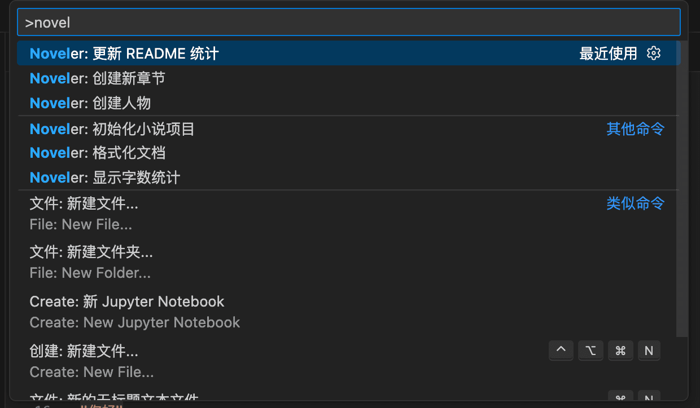
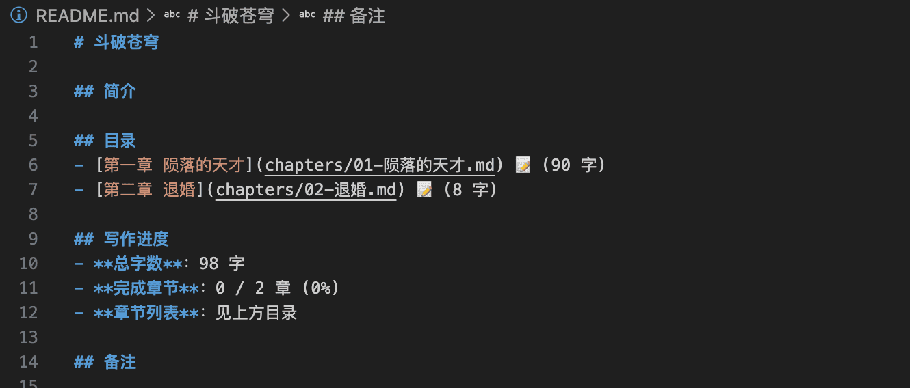
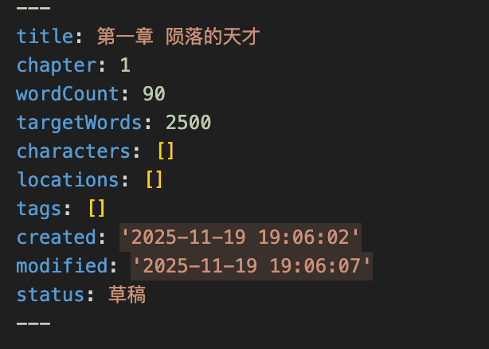
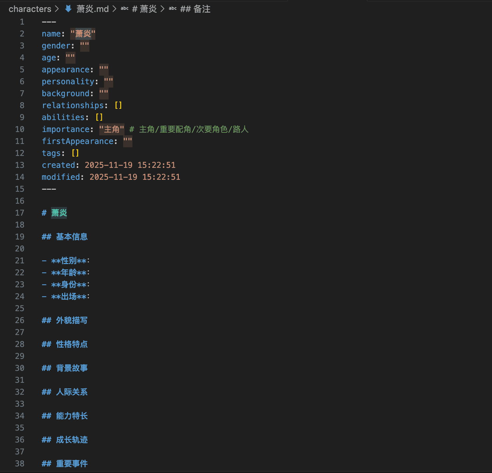

# Noveler - 中文小说写作助手

专为中文小说写作设计的 VS Code 插件，提供语法高亮、格式化、字数统计等实用功能，让创作更加流畅。


## ✨ 功能特性

### 📝 语法高亮

让你的小说内容一目了然，不同元素清晰区分：

- **对话高亮**：支持多种引号格式 `「」` `""` `""` `''` `""` `''`
- **人物名称**：自动读取 `characters/` 目录和 `novel.json` 中配置的人物名称进行高亮


### 📊 精准字数统计

准确的字数统计，符合网文创作标准：

- **状态栏显示**：`总计 xxx | 正文 xxx | 标点 xxx`（左下角实时显示）
- **智能统计**：
  - 总计 = 正文 + 标点（不含空格）
  - 正文 = 中文汉字 + 英文字母和数字
  - 标点 = 中文标点（含 `""`、`…`、`—` 等）+ 英文标点
- **自动排除**：Front Matter、Markdown 标题、HTML 注释、所有空格
- **选中统计**：选中任何文本（包括标题）时显示选中部分的字数
- **侧边栏 hover**：鼠标悬停章节名称即可查看详细字数统计
- **保存自动更新**：保存文件时自动更新 Front Matter 中的 `wordCount` 字段

### 🎨 智能格式化

- **引号统一**：自动转换中英文引号为配置的样式
- **标点规范**：统一中文标点符号（双向转换）
- **空格处理**：删除中文之间多余的空格
- **特殊符号**：统一省略号（…）和破折号（——）

### 🛡️ 敏感词检测

自动检测小说中的敏感词汇，帮助规避审核风险：

- **三级词库系统**：
  - **高危**：政治、严重暴力、严重违法（推荐启用）
  - **中危**：色情、一般违法、宗教敏感（推荐启用）
  - **低危**：广告、争议词汇、不文明用语（可选启用）
- **实时检测**：输入时自动检测（防抖 500ms），保存时再次检查
- **可视化标注**：黄色波浪线标记敏感词，问题面板显示详细信息
- **快速修复**：
  - 添加到白名单（如人物名、专有名词）
  - 删除敏感词
  - 替换为星号（***）
  - 忽略此处
- **自定义词库**：支持项目级黑名单和白名单配置
- **状态栏显示**：实时显示当前文档中的敏感词数量
- **灵活配置**：可选择启用的检测级别、检测时机、显示方式等

### ✍️ 写作辅助

- **自动空行**：在 chapters 目录下按回车时自动插入空行，保持段落间距（可在 novel.json 中配置开关）
- **输入验证**：创建章节和人物时自动过滤非法字符，确保文件名安全
- **专注模式**：一键进入全屏 Zen Mode，隐藏所有干扰元素，专心写作
- **自动保存**：插件自动启用 VSCode 自动保存功能（1秒延迟），防止意外丢失内容
- **字号设置**：为 Markdown 文件单独配置舒适的阅读字号，不影响其他文件类型

### 📂 项目管理

快速创建和组织你的小说项目：



#### 初始化项目
一键创建标准的小说项目结构，包含章节、人物、草稿等目录。

#### 创建章节
- 自动计算章节序号（支持中文数字：第一章、第十章、第一百章、第一千章等）
- 带有完整 Front Matter 的标准章节模板
- 自动组织到 `chapters/` 目录

#### 创建人物
- 一键创建人物档案文件
- 完整的人物信息模板（外貌、性格、背景、关系等）
- 自动保存到 `characters/` 目录

#### README 自动更新
- 扫描章节目录，统计总字数和完成章节数
- 自动生成章节列表（带状态图标：📝✏️🔧✅）
- 自动扫描并分类展示人物（主角、重要配角、次要配角、路人）
- 创建章节/人物后可选择是否自动更新（可配置：always/ask/never）
- 一键更新项目 README



## 📥 安装

### 从 VSCode 市场安装（推荐）

1. 打开 VS Code
2. 按 `Cmd+Shift+X` (Mac) 或 `Ctrl+Shift+X` (Windows/Linux) 打开扩展面板
3. 搜索 "Noveler"
4. 点击"安装"

### 手动安装

1. 下载最新的 `.vsix` 文件
2. 在 VS Code 中按 `Cmd+Shift+P` (Mac) 或 `Ctrl+Shift+P` (Windows/Linux)
3. 输入 "Extensions: Install from VSIX"
4. 选择下载的 `.vsix` 文件

## 🚀 快速开始

### 1. 初始化项目

1. 打开一个空文件夹作为工作区
2. 按 `Cmd+Shift+P` (Mac) 或 `Ctrl+Shift+P` (Windows/Linux)
3. 输入 "Noveler: 初始化小说项目"
4. 按提示输入小说名称

插件会自动创建以下目录结构：

```
my-novel/
├── chapters/              # 章节目录
├── characters/            # 人物目录
├── drafts/                # 草稿和大纲
│   └── 大纲.md
├── references/            # 参考资料
├── novel.json            # 小说配置文件
└── README.md             # 项目说明
```

### 2. 创建章节

1. 按 `Cmd+Shift+P` (Mac) 或 `Ctrl+Shift+P` (Windows/Linux)
2. 输入 "Noveler: 创建新章节"
3. 输入章节标题（章节号会自动计算）

### 3. 开始写作

打开章节文件，享受语法高亮和实时字数统计！

## 📄 文件格式

### 章节文件示例



```markdown
---
title: "第一章 初入江湖"
chapter: 1
wordCount: 0
targetWords: 5000
characters: ["张无忌", "周芷若"]
locations: ["武当山"]
tags: ["武侠", "成长"]
created: "2025-11-19 10:00:00"
modified: "2025-11-19 10:00:00"
status: "草稿"  # 草稿 | 初稿 | 修改中 | 已完成
---

# 第一章 初入江湖

清晨的阳光透过窗棂洒在青石板上。

「师父，我想下山。」张无忌低声说道。

（这孩子终于长大了。）老道长抚须而笑。
```

### 人物文件示例



```markdown
---
name: "张无忌"
gender: "男"
age: "20"
appearance: "眉清目秀，英俊潇洒"
personality: "善良仁慈，优柔寡断"
background: "武当派弟子，明教教主"
relationships: ["周芷若", "赵敏", "谢逊"]
abilities: ["九阳神功", "乾坤大挪移"]
importance: "主角"
firstAppearance: "第一章"
tags: ["主角", "武林盟主"]
created: "2025-11-19 10:00:00"
modified: "2025-11-19 10:00:00"
---

# 张无忌

## 基本信息
...

## 外貌描写
...

## 性格特点
...
```

## ⚙️ 配置

### 项目级配置（推荐）

在项目根目录的 `novel.json` 文件中配置：

```json
{
  "name": "我的小说",
  "noveler": {
    "highlight": {
      "dialogue": {
        "color": "#ce9178",
        "backgroundColor": "rgba(206, 145, 120, 0.15)"
      },
      "character": {
        "color": "#4ec9b0",
        "fontWeight": "bold"
      }
    },
    "format": {
      "chineseQuoteStyle": "「」",
      "autoFormat": true
    },
    "wordCount": {
      "showInStatusBar": true
    },
    "editor": {
      "markdownFontSize": 16
    },
    "autoEmptyLine": true,
    "characters": ["张无忌", "周芷若", "赵敏"],
    "sensitiveWords": {
      "enabled": true,
      "levels": {
        "high": true,
        "medium": true,
        "low": false
      },
      "checkOnType": true,
      "checkOnSave": true,
      "customWords": {
        "enabled": true,
        "blacklistPath": ".noveler/sensitive-words/blacklist.json",
        "whitelistPath": ".noveler/sensitive-words/whitelist.json"
      },
      "display": {
        "severity": "Warning",
        "showInProblems": true,
        "showWordCount": true
      }
    }
  }
}
```

**配置说明**：
- `editor.markdownFontSize`：Markdown 文件的字号（推荐 16-18）
- `autoEmptyLine`：是否自动插入空行
- `characters`：全局人物名称列表，用于高亮
- `sensitiveWords.enabled`：是否启用敏感词检测
- `sensitiveWords.levels`：启用的检测级别（high/medium/low）
- `sensitiveWords.checkOnType`：是否在输入时检测（防抖 500ms）
- `sensitiveWords.checkOnSave`：是否在保存时检测
- `sensitiveWords.customWords`：自定义词库配置（黑名单/白名单路径）
- `sensitiveWords.display`：显示设置（严重性、是否显示数量等）

详细配置说明请查看 [novel.json 配置文档](docs/novel-json配置说明.md)

### 全局配置（可选）

如果没有 `novel.json` 文件，插件会回退到 VS Code 全局设置。在 VS Code 设置中搜索 "Noveler"：

```json
{
  "noveler.autoFormat": true,
  "noveler.showWordCountInStatusBar": true,
  "noveler.chineseQuoteStyle": "「」",
  "noveler.autoEmptyLine": true,
  "noveler.autoSave": true,
  "noveler.autoUpdateReadmeOnCreate": "ask"
}
```

**推荐使用项目级配置（`novel.json`）**，因为：
- ✅ 配置跟随项目，方便版本管理
- ✅ 不同项目可以有不同的配置
- ✅ 团队协作时配置统一

## 🎯 常用命令

| 命令 | 说明 |
|------|------|
| `Noveler: 初始化小说项目` | 在空文件夹中初始化项目结构 |
| `Noveler: 创建新章节` | 创建新章节文件 |
| `Noveler: 创建人物` | 创建人物文件 |
| `Noveler: 更新 README 统计` | 扫描章节并更新 README 统计信息 |
| `Noveler: 格式化文档` | 格式化当前文档 |
| `Noveler: 显示字数统计` | 显示详细字数统计 |
| `Noveler: 切换专注模式` | 进入/退出专注写作模式 |
| `Noveler: 重置字号` | 重置字号为默认值 |

## 📋 Front Matter 字段说明

### 章节文件字段

| 字段 | 类型 | 说明 | 自动更新 |
|------|------|------|----------|
| title | string | 章节标题 | - |
| chapter | number | 章节号 | - |
| wordCount | number | 字数 | ✓ 保存时 |
| targetWords | number | 目标字数 | - |
| characters | string[] | 出场人物 | - |
| locations | string[] | 场景地点 | - |
| tags | string[] | 标签 | - |
| created | datetime | 创建时间 | - |
| modified | datetime | 修改时间 | ✓ 保存时 |
| status | enum | 状态 (草稿/初稿/修改中/已完成) | - |

### 章节状态说明

- **草稿** 📝 - 刚创建的初始状态
- **初稿** ✏️ - 完成第一遍写作
- **修改中** 🔧 - 正在修改润色
- **已完成** ✅ - 最终完成状态

## 🔧 技术栈

- **开发语言**: TypeScript
- **插件框架**: VS Code Extension API
- **语法高亮**: Decorator API（动态高亮）
- **文档格式**: Markdown + Front Matter (YAML)
- **Front Matter 解析**: gray-matter

## 🗺️ 路线图

### v0.1.0
- ✅ 基础语法高亮（对话、人物）
- ✅ 实时字数统计（网文标准计数）
- ✅ 智能格式化（标点双向转换）
- ✅ 自动空行（chapters 目录可配置）
- ✅ 输入验证（文件名安全过滤）
- ✅ 创建章节模板（自动编号）
- ✅ 人物管理
- ✅ README 自动更新
- ✅ 中文数字章节号（支持任意大数字）

### v0.2.0
- ✅ 专注模式（一键进入 Zen Mode）
- ✅ 自动保存（自动启用 VSCode 自动保存）
- ✅ 侧边栏视图（项目概览、章节列表、人物管理）
- ✅ 配置系统（novel.json 优先级支持）

### v0.3.0 (当前版本)
- ✅ 侧边栏智能刷新（创建/保存/修改文件时自动更新）
- ✅ README 人物汇总（自动扫描并分类展示人物）
- ✅ 灵活的 README 更新配置（always/ask/never）
- ✅ 统一错误处理模块
- ✅ 文件监控系统（FileSystemWatcher）

### v0.4.0+ (计划中)
- ⏳ 智能提示（人物、场景、对话）
- ⏳ 人物关系图可视化
- ⏳ 更丰富的语法高亮规则
- ⏳ 时间线管理工具
- ⏳ 导出功能（HTML、PDF、EPUB）
- ⏳ 写作目标跟踪
- ⏳ AI 写作助手集成

## ❓ 常见问题

### Q: 字数统计不准确？
A: 字数统计会自动排除 Front Matter、HTML 注释和 Markdown 标题标记，只计算正文内容。采用网文标准计数方式（排除空白字符后的所有字符）。

### Q: 如何自定义语法高亮颜色？
A: 在项目的 `novel.json` 文件中配置 `noveler.highlight` 字段。详见[配置文档](docs/novel-json配置说明.md)。

### Q: 格式化会覆盖我的内容吗？
A: 格式化只会调整标点符号和空格，不会修改文字内容。且 Front Matter 和 HTML 注释内容不会被格式化。

### Q: 如何更新 README 中的统计信息？
A: 使用命令 `Noveler: 更新 README 统计`，插件会自动扫描章节并更新字数、完成度等信息。

### Q: 章节号支持多大的数字？
A: 支持任意大小的数字转换为中文，包括万、亿等大单位。例如：1000 → 第一千章，10000 → 第一万章。

### Q: 自动空行功能在哪些文件生效？
A: 仅在小说项目的 chapters/ 目录下的 Markdown 文件生效。可在 novel.json 或 VSCode 设置中配置 `autoEmptyLine` 开关。

## 🤝 贡献

欢迎提交 Issue 和 Pull Request！

1. Fork 本仓库
2. 创建你的特性分支 (`git checkout -b feature/AmazingFeature`)
3. 提交你的更改 (`git commit -m 'Add some AmazingFeature'`)
4. 推送到分支 (`git push origin feature/AmazingFeature`)
5. 打开一个 Pull Request

## 📜 开源协议

[MIT License](LICENSE)

## 📞 联系方式

- GitHub: [https://github.com/ChangFang911/vscode-plugin-noveler](https://github.com/ChangFang911/vscode-plugin-noveler)
- Issues: [提交问题](https://github.com/ChangFang911/vscode-plugin-noveler/issues)

---

**Happy Writing! 祝写作愉快！** ✍️
